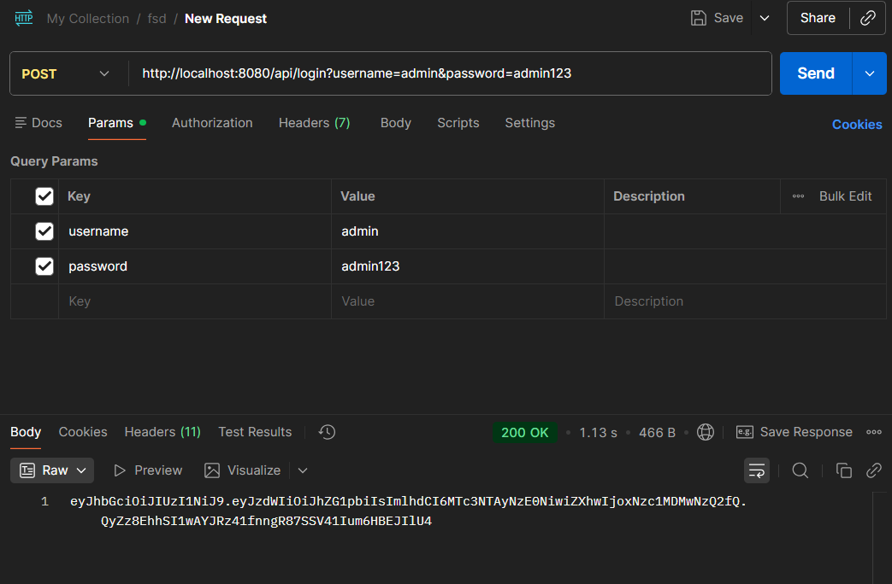
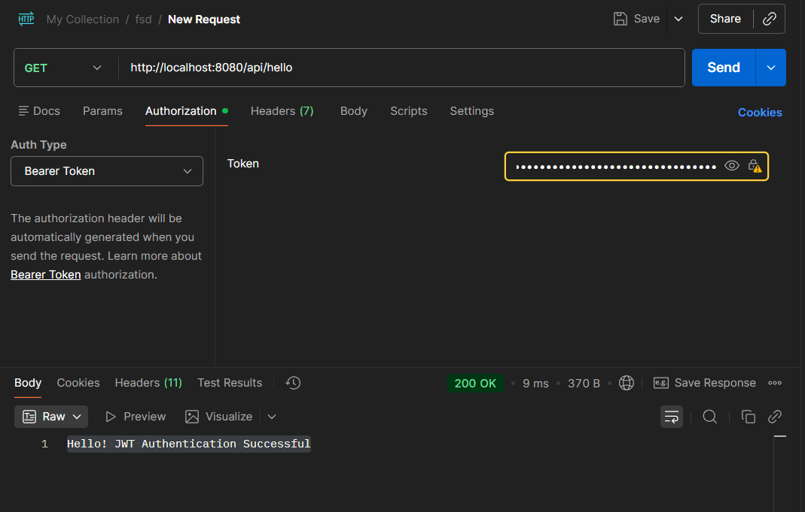

# Experiment 9: Securing REST APIs using JWT Authentication

## Overview
This project demonstrates how to secure a Spring Boot REST API using **JSON Web Tokens (JWT)**. It showcases a typical authentication flow where a user logs in with valid credentials, receives a JWT, and then uses that token to access a protected endpoint.

## Technologies Used
- **Java 17+**
- **Spring Boot** (Spring Web, Spring Security, Spring Data JPA)
- **JSON Web Token (jjwt)** for token generation and validation
- **MySQL Database**
- **Postman** (for API testing)

## Database Setup
A MySQL database needs to be configured before running the application. A SQL script (`setup_db.sql`) is provided in the root directory to set up the database and a default user.

**setup_db.sql:**
```sql
-- 1. Create the database
CREATE DATABASE IF NOT EXISTS jwt_demo;
USE jwt_demo;

-- 2. Create the 'users' table
CREATE TABLE IF NOT EXISTS users (
    id BIGINT AUTO_INCREMENT PRIMARY KEY,
    username VARCHAR(255),
    password VARCHAR(255)
);

-- 3. Insert a single test value
INSERT INTO users (username, password) VALUES ('admin', 'admin123');
```

## REST Endpoints Overview
The application handles the authentication flow using the following endpoints:

### 1. User Login / Generate Token (POST)
**Endpoint:** `POST /api/login`  
**Description:** Authenticates a user with a `username` and `password`. If valid, it returns a digitally signed JWT token.

**Request Parameters:**
- `username`: `admin`
- `password`: `admin123`

**Response Example:**
```text
eyJhbGciOiJIUzUxMiJ9... (Token String)
```
#### Output Screenshot


---

### 2. Access Protected Resource (GET)
**Endpoint:** `GET /api/hello`  
**Description:** A requested resource that is protected by Spring Security. It requires a valid JWT token in the `Authorization` header to access.

**Headers Required:**
- `Authorization`: `Bearer <Your_JWT_Token>`

**Response Example (Authorized):**
```text
Hello! JWT Authentication Successful
```
#### Output Screenshot


## How to Run the Project
1. Open your MySQL Command Line or Workbench and run the contents of `setup_db.sql` to initialize the `jwt_demo` database and add the default `admin` user.
2. If necessary, configure your MySQL username and password in `JWT-DEMO/src/main/resources/application.properties`.
3. Open a terminal and navigate to the `JWT-DEMO` folder.
4. Run the project using the Maven Wrapper:
```bash
./mvnw spring-boot:run
```
*(On Windows, you can also use `.\mvnw.cmd spring-boot:run`)*
5. The backend application will start on port `8080`.
6. Open **Postman** (or another REST client) to test the authentication flow:
   - First, call `/api/login` with form parameters or query parameters to retrieve the token.
   - Second, configure Postman Authorization header as a `Bearer Token`, paste the received token, and request `/api/hello`.
